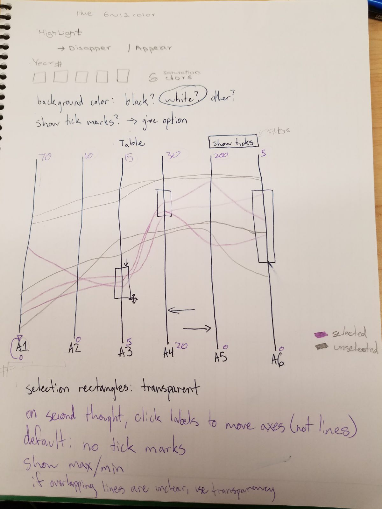
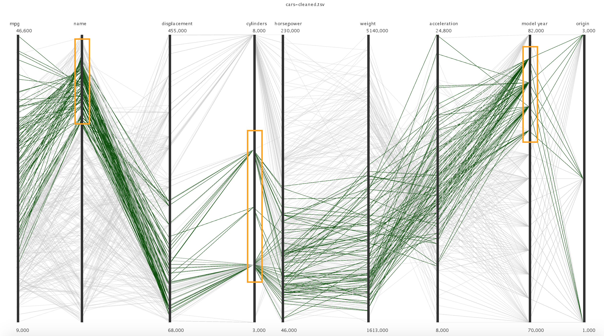

# HW1: Parallel Coordinates

This homework is done by Khin Thiri Kyaw and Brighten Jelke.

**Design Decisions**

Because this parallel coordinates visualization needs to be generalized to many datasets, we thought about the rows and columns of the data in terms of items and attributes. Following the design principle of details-on-demand, we originally planned to have a button to allow users to decide if they wanted to show tick marks or not. We felt it was important to show all of the lines to maintain context, so lines that are filtered out are drawn in grayscale and transparent. The sketch of our prototype is attached below.

We decided after some experimentation that purple was not the best choice for encoding with color hue, although in this version it is only saturation that matters. The two colors we eventually decided on that are not in grayscale (dark green for the lines and orange for the filter boxes) were chosen to be safe for colorblind viewers. Our output was checked using a color blindness simulator. This version is shown below.

Our final implementation does look very similar to our prototype. The main changes are actually in how it feels to use and interact with rather than how it looks. For example, in the prototype, the name labels of the attributes are on the bottom, and the filter boxes are moved by clicking on the bottom edge. We found that it is more intuitive to move these objects around with both of those things being on the top. In addition, separating the regions for rearranging and filtering reduces occlusion and the likelihood that the user will become frustrated if they can't select what they actually want to.

When the places of attributes are swapped, the gaps between them are not uniform because we want to give the users an option to freely choose the space between the attributes. Providing expanded or contracted views in this way supports the task of finding outliers in the dataset.

As mentioned earlier, our original prototype includes a button to show tick marks. This was changed to keyboard input because we felt it was unnecessary to take up more space on the screen with a clickable button. The downside to this is that it is unlikely users would find such a feature without being explicitly told about it. However, that does not make it a bad visualization; that's what the user's manual is for. 

**User's Manual**
To rearrange the attributes, click in the center of its name and drag left or right.
To filter out certain items, first click anywhere on the black line below the name of the attribute. An orange filtering box will appear. To move the location of the box on the line, click on the top orange part of the box and drag up or down. To expand or contract the height of the box, click on the bottom orange part of the box and drag down or up, respectively. 

Press the 'm' key to toggle between showing additional marks or not. Currently, this input will only show the minimum and maximum values for attributes that contain numbers.
 
**Future Improvements**

If we had more time, we would implement the feature where users can hover over the item and it shows the values for each attribute, including strings. There is also significant code optimization that can be done, as well as minor aesthetic changes like font size and type for enjoyability and ease of use. Another area for refinement is the rearranging of axes. While we believe it is important to allow for varying distances between attributes, it is difficult to space them evenly again after doing so. A "snapping" feature, that constrained the x position of an attribute if it moved within a certain distance, could address this. This design works for users that already have some familiarity with the data, but for those that do not, showing more specifics will be essential. 
